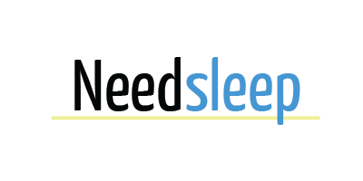

## Needsleep

App for tracking your sleep! I plan adding new features or using this project as a base to create another app. I want to build a productivity swiss army knife app in order to reduce the number of clicks that it takes to do simple things like logging the time when you sleep. This app accomplishes this by looking at your localtime and all you have to do it click a button when you want to sleep. The time you sleep will be logged into the mysql database. You data is saved on this database so you will have access to it anywhere.

### Installation

Run the following command in terminal:
`npm install`

Then you need to use a Scss compiler like [sass.js.org/](https://sass.js.org/) to convert `/public/scss` to this directory `/public/css`. You need to make sure the bootstrap import in the correct location by specifying the file system.

### Technologies
##### frontend:
 - d3js
 - bootstrap
 - Sass
##### backend:
 - node
 - express
 - passport
 - bcrypt
 - Mysql
 - Sequelize
 - handlebars
 - jawsdb

### Database
User - sequelize defaults, email, username, password
Bed - userid, type(wake/bed), date

sequelize defaults are: createdat, updatedat, id
### Progress
See the trello board here: [trello.com](https://trello.com/b/IoNT9oOG/needsleep)